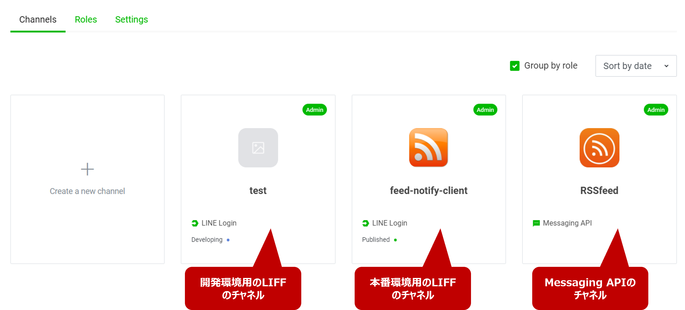
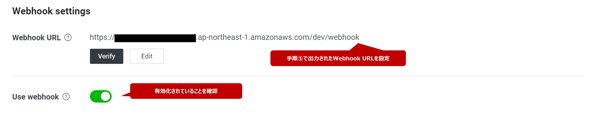
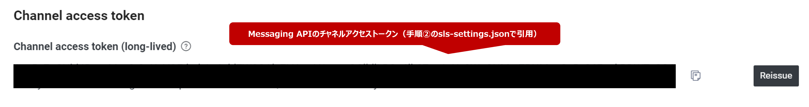
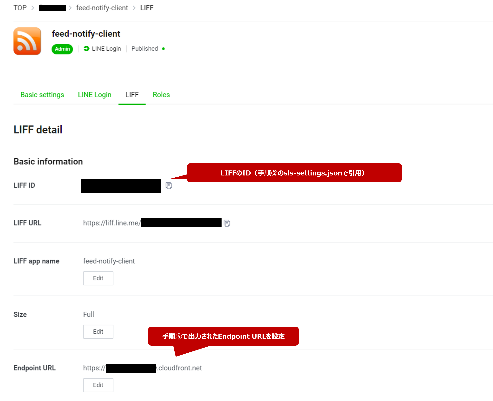
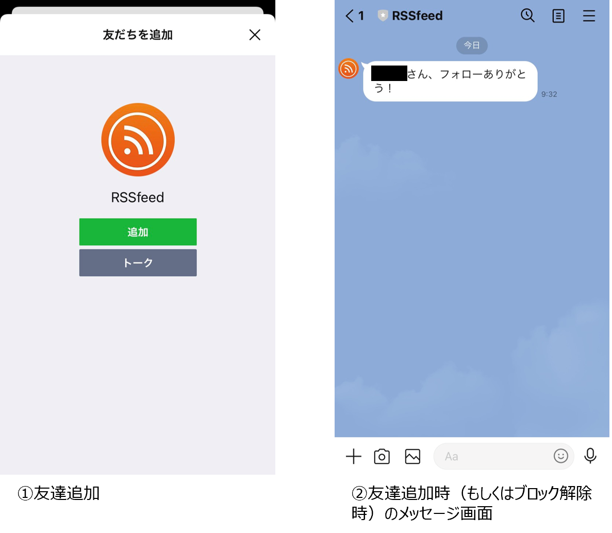
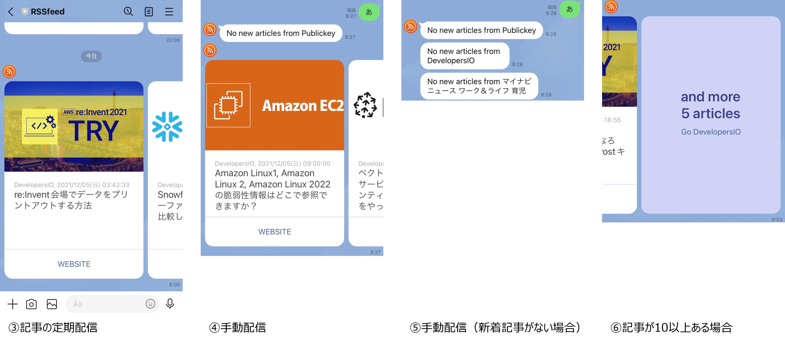
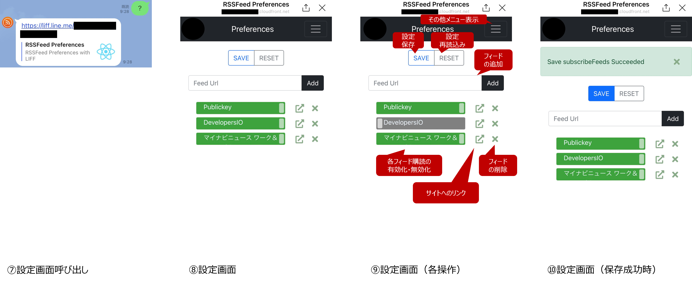
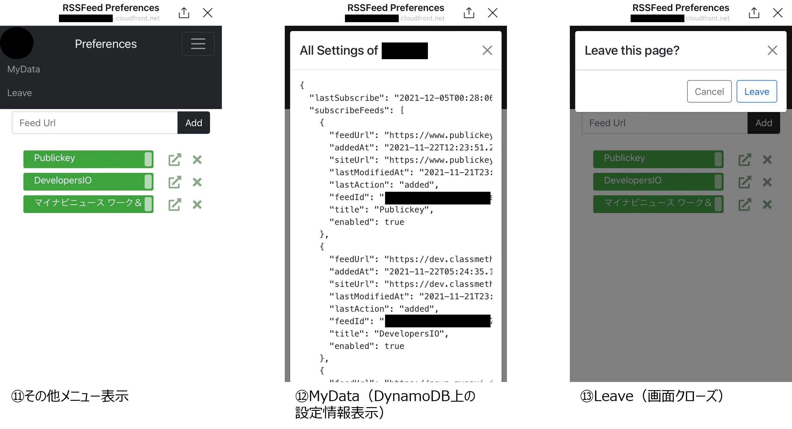

# Feed-Notifyアプリについて

## 概要

* RSSFeedで配信された記事を、LINE Messaging API経由で購読する
* 購読対象の記事は、設定用サイトで追加・削除・有効化・無効化が可能
* 定期購読のほかに、LINEでメッセージを送ることで記事を手動購読することも可能
* システム構成は以下の通り。AWS上にソースをデプロイし、LINE Messaging API・LIFFと連携させる。


## 環境

| 種類                 | バージョン             |
| -------------------- | ---------------------- |
| OS                   | Windows10 version 2004 |
| Node                 | 14.17.5                |
| Serverless Framework | 2.66.1                 |
| 開発環境             | VSCode & Powershell    |

## 使い方

node.jsの開発環境と、aws cli、serverless frameworkがインストールされている前提で以下の通り進めていく。

### ⓪ LINE DEVELOPERSで、Messaging APIと、開発環境用・本番環境用それぞれのLIFFを設定

下図のように、Messaging APIと、開発環境用・本番環境用それぞれのLIFFで計3つのチャネルを作成する。


Messaging APIを設定する上での参考

* [LINE Messaging APIの概要](https://developers.line.biz/ja/docs/messaging-api/overview/)
* [Messaging APIを始めよう](https://developers.line.biz/ja/docs/messaging-api/getting-started/)
* [（チュートリアル）Node.jsを使ってサンプル応答ボットを作る](https://developers.line.biz/ja/docs/messaging-api/nodejs-sample/)

LIFF(LINE Front-end Framework)を設定する上での参考

* [LINE Front-end Framework](https://developers.line.biz/ja/docs/liff/overview/#operating-environment)
* [https://developers.line.biz/ja/docs/liff/getting-started/](https://developers.line.biz/ja/docs/liff/getting-started/)

Messaging APIとAWS上のアプリケーションを連携させるうえで、下図のChannel Access TokenとWebhook URLがポイントとなる。




また、LIFFの設定におけるポイントは下図の通り。



### ① 各モジュールを`npm install`でインストール

`server`ディレクトリ、`client`ディレクトリ双方で`npm install`をすればOK。

### ② `sls-settings.json`で各設定を入れる

`sls-settings.json`の内容は以下の通り。

```json
{
  "TOKEN": "XXXXXXXXXXXXXXXXXXXXXXXXXXXXXXXXXXXXXXXXXXXXXXXXXXXXXXXXXXXXXXXXXX",
  "LIFF_ID_PROD": "1234567890-aaaaaaaaa",
  "LIFF_ID_DEV": "9876543210-bbbbbbbb",
  "LAYERS_DEPLOYMENT_BUCKET": "xxxx-bucket-lambda-sls"
}
```

* `TOKEN`: LINE Messaging API経由でメッセージを送信するための認証トークン。⓪で設定した際に取得できる。
* `LIFF_ID_PROD`: 本番環境用のLIFFのID。これに紐づくURLがCloudfront-S3環境上に配備した静的サイトと連携する。⓪で設定した際に取得できる。
* `LIFF_ID_DEV`: ローカル開発環境用のLIFFのID。これに紐づくURLがローカルで開発しているサイト（https://`localhost:3001`）と連携する。⓪で設定した際に取得できる。
* `LAYERS_DEPLOYMENT_BUCKET`: Serverless Frameworkのプラグインである`Serverless-Layers`を使ってnode_modulesをLambdaのLayerに入れるために経由するS3のバケット名。あらかじめAWS上でS3バケットを作っておく。

### ③ ローカル開発環境上で動作確認する

* `server`ディレクトリ上で`serverless dynamodb install`および`serverless offline start`を実行し、サーバ側を起動させる。（`serverless-offline`および`serverless-dynamodb-local`プラグインを使用。なお、`serverless dynamodb install`は`.dynamodb`ディレクトリが作成されたら一度だけ実施すればOK）
* `client`ディレクトリ上で`.env.development.local`ファイルを作成したうえで以下のように設定を加える。その後、`npm run start`もしくは`yarn start`でクライアントサイドを起動

```env
PORT = 3001
HTTPS = "true"
REACT_APP_LIFF_ID_DEV="9876543210-bbbbbbbb"
REACT_APP_API_URL_DEV="http://localhost:3000/dev"
```

* Postman等で`http://localhost:3000/dev/webhook`にpostリクエストを飛ばしたり、クライアントサイドの画面でいろいろ動作確認を行う。postリクエストのBody例は以下。`body.events[].message.text`の内容が"?"や"設定"などの場合は設定画面、そうでない場合はRSSフィード通知をLINEに送信する。実際にLINEと連携もされるため、LINEのデスクトップアプリも入れておくとよい。
* プッシュメッセージが配信されないため、**replyTokenは`xxx`で固定する。**。また、LINEユーザID部分は`all`とすると、全ユーザにプッシュメッセージを送信可能。

```json
{
    "destination": "xxxxxxxxxx",
    "events": [
        {
            "type": "message",
            "message": {
                "type": "text",
                "id": "xxxxxxxx",
                "text": "?"
            },
            "source": {
                "type": "user",
                "userId": "Uxxxxxxxxxxxxxxxxxxxxxxxxxxx(LINEユーザID)"
            },
            "replyToken": "xxx"
        }
    ]
}
```

### ④ トップにある`deploy.ps1`を実行する

まずはサーバー側のリソースをデプロイし、API GatewayのエンドポイントURL取得。それを環境変数に設定したうえでクライアント側のReactソースをビルドし、S3＆Cloudfront環境を構築。

### ⑤ `deploy.ps1`実行後に表示される内容をLINE Developers Consoleで設定

以下の内容が`deploy.ps1`実行後に表示されるため、`Webhook URL`をMessaging APIの`Webhook URL`に、`Endpoint URL`をLIFFの`Endpoint URL`に設定する

```shell
*********************************
**LINE DEVELOPERS CONFIGURATION**
Webhook URL for LINE Messaging API
https://xxxxxxxxxx.execute-api.ap-northeast-1.amazonaws.com/dev/webhook
Endpoint URL for LIFF
https://xxxxxxxxxxxxxx.cloudfront.net
*********************************
```

## 使ったサービス・言語・フレームワーク

| サービス・言語等   | 詳細                                                                                                                                                                                                                |
| ------------------ | ------------------------------------------------------------------------------------------------------------------------------------------------------------------------------------------------------------------- |
| 言語・環境         | バックエンドのロジックはすべてNode.js v14.17.5で構築。                                                                                                                                                              |
| フレームワーク     | フレームワークはServerless Framework v2.66.2を用いて、AWS上サービスをデプロイした。 また、いくつかプラグインを導入した（*※1*）。                                                                                    |
| LINE Messaging API | LINE上でのメッセージを受信し、適切な応答をするためにLINE Messaging APIを導入。無料枠で利用するので、月1,000件のメッセージ送信数制限には要注意・・・。応答はFlex Message（カルーセル型）もしくはテキスト形式で実施。 |
| LIFF               | LINE Front-end Framework (LIFF)を使って、設定用のWebサイトで、LINEログインを利用しユーザID・名前・プロフィール画像を取得。                                                                                          |
| データベース       | AWS DynamoDBにユーザごとの情報（*※2*）を格納。                                                                                                                                                                      |
| UI                 | React + React-Bootstrap + Fontawesomeで設定画面のUIを構築。                                                                                                                                                         |

*※1 利用したServerless Frameworkのプラグインは以下の通り。*

```yml
plugins:
  - serverless-dynamodb-local #Server側：DynamoDB接続部分の開発・テスト用
  - serverless-vpc-plugin #Server側：Lambda用のVPC作成
  - serverless-offline #Server側：ローカルでの開発・テスト
  - serverless-layers  #Server側：Lambda Layersを利用するためのプラグイン
  - serverless-s3-sync #Client側：ビルドしたフロントエンドのS3アップロード
  - serverless-cloudfront-invalidate #Client側：CloudFrontのキャッシュ削除自動化
```

*※2 DynamoDBレコードの構成は以下の通り。*

`userId`:ユーザID  
`lastSubscribe`:RSSフィードの最終配信日時  
`subscribeFeeds`:購読するRSSフィード情報(ここではPublicKeyとDevelopersIOの2つ)  
`name`:ユーザ名  

```json
{
 "userId": "U0000000000000000000000000000000", 
 "lastSubscribe": "2021-11-25T01:00:19.091Z", 
 "subscribeFeeds": [
  {
   "feedUrl": "https://www.publickey1.jp/atom.xml",
   "addedAt": "2021-11-22T12:23:51.240Z",
   "siteUrl": "https://www.publickey1.jp/",
   "lastModifiedAt": "2021-11-21T23:23:51.240Z",
   "lastAction": "added",
   "feedId": "xxxxxxxxxxxxxxxxxxxxxxxxxxxxxxxxxxx",
   "title": "Publickey",
   "enabled": true
  },
  {
   "feedUrl": "https://dev.classmethod.jp/feed/",
   "addedAt": "2021-11-22T05:24:35.168Z",
   "siteUrl": "https://dev.classmethod.jp",
   "lastModifiedAt": "2021-11-21T23:24:35.168Z",
   "lastAction": "added",
   "feedId": "xxxxxxxxxxxxxxxxxxxxxxxxxxxxxxxxxxx",
   "title": "DevelopersIO",
   "enabled": true
  }
 ],
 "name": "XXX"
}
```

## 機能説明

### 友達追加



LINE Messaging APIとして設定したアカウントを友達追加したときの動きは上の図①②の通り。  
LIFF経由でユーザ名を取得し、メッセージを投稿する。ブロック解除時も同様のメッセージを投稿する。  
なお、このタイミングでsubscribeFeeds配列が空のレコードがDynamoDB上で追加される。  
（ブロック時、もしくはフォロー解除時にDynamoDB上からレコードが削除される。）

### 記事配信



日本時間で毎日6時から22時まで、4時間ごとに新着記事を配信する。（上図③）  
なお、適当なメッセージ（後述の設定画面呼び出し用の文言を除く）を投稿すると、手動でも新着記事を取得できる。手動の場合は登録しているフィード配信先それぞれについて新着記事がなければメッセージを表示、もしあれば記事情報を表示する。（上図④⑤）  
**LINE Messaging APIのカルーセル型の仕様で、10個までしか情報が載せられない**ため、記事が10個以上ある場合は配信サイトへのリンクを表示している。（上図⑥）  
なお、定期配信でも手動配信でも、DynamoDBレコード上の`lastSubscribe`に定義された時刻から現在時刻の間に配信された記事を新着記事として表示する仕様となっている。

### 設定画面



特定のメッセージ（*※３*）を打つと、設定画面（S3にホスティングし、Cloudfront経由で配信している画面）にリダイレクトするURLが返される。（上図⑦）  
これを押下することで、LIFF経由で設定画面にアクセスできる。（上図⑧）  
上図⑨に示す、各機能の説明は以下の通り。

| 操作                           | 内容                                                                                                                                                                  |
| ------------------------------ | --------------------------------------------------------------------------------------------------------------------------------------------------------------------- |
| その他メニュー表示             | 後述するその他のメニュー（MyData, Leave）を表示する。                                                                                                                 |
| 設定保存                       | 本画面で操作した内容を保存（DynamoDBを更新）する。**このボタンを押さないと、本画面での操作は反映されない**ので要注意。成功すると、その旨アラート表示される。（上図⑩） |
| 設定再読込み                   | 直最後に保存した設定を再読み込みする。                                                                                                                                |
| フィードの追加                 | 購読対象のフィードを追加する。**ブログサイトのURLではなく、RSS FeedのURLを入れる必要がある**ため要注意。                                                              |
| 各フィード購読の有効化・無効化 | トグルボタンを操作することで、リストから削除しなくても購読の有効化・無効化が可能。                                                                                    |
| サイトへのリンク               | フィード配信元のサイトにアクセスできる。                                                                                                                              |
| フィードの削除                 | 一覧からフィードを削除する。                                                                                                                                          |

*※３　"設定", "一覧", "確認", "?", "？"が該当。`server/functions/webhook.js`の`prefArr`にて該当の文字列を定義。*

### 設定画面（その他メニュー）



画面右上のハンバーガーボタンを押下すると、その他メニューが表示される。（上図⑪）  
MyDataを押下すると、DynamoDBに保存されている自身の設定情報の全量が表示される。（上図⑫）  
Leaveを押下すると、確認のモーダルウィンドウが表示され、そこでも「Leave」を押下すると設定画面が閉じる。「Cancel」を押下すると設定画面に戻る。（上図⑬）

## 注意点（LINE Messaging APIの制約）

2021年12月現在、LINE Messaging APIは以下の制約があるため、要注意。

### 毎月のメッセージ配信数

無料枠で配信できるメッセージは毎月1,000通まで（[料金プラン](https://www.linebiz.com/jp/service/line-official-account/plan/)）。  
1日5回の定期配信であれば1か月約150通程度でありまだ余裕があるが、利用ユーザが増えると上限に引っかかる可能性があるため要注意。  
なお、応答メッセージは通数にカウントされないものと思われるため、手動配信や設定画面呼び出しは応答メッセージを使い、1,000通にカウントされるのは定期配信のプッシュメッセージのみとしている。

### 1度の配信でのメッセージ数

1通のメッセージ配信には、5件までしかメッセージオブジェクトを指定できない（[プッシュメッセージを送る](https://developers.line.biz/ja/reference/messaging-api/#send-push-message)）。  
そのため、登録できるRSSフィードは5サイトまでという制約がある。複数回に分けて配信してもいいが、その際は前述の毎月1,000通の上限に引っかかりやすくなる。そのため、現時点では制約としている。

### 1通のメッセージに表示される記事の数

本アプリでは新着記事をカルーセル型で配信しているが、その要素（バブル）の数は最大10個までという制約がある（[カルーセルテンプレート](https://developers.line.biz/ja/reference/messaging-api/#carousel)）。  
そのため、新着記事が10個を超える場合は、新着記事をバブルで表示するのは9個までにして、10個目には配信元のサイトへのリンクを表示することとしている。

## ソース概要

### /

#### README.md

本ドキュメント。

#### doc/

本ドキュメントで引用する画像などを格納。

#### deploy.ps1

`server`および`client`に格納されたソースをServerless Frameworkで一括デプロイするためのツール。  
Powershellベースで記述している。  
大まかにいうとバックエンド側のデプロイ→バックエンドのURL情報などを参照しつつReactソースをビルド→クライアント側のデプロイという流れ。

### server/

バックエンド側のロジックを格納している。  
`server/serverless.yml`に記述したとおりに、AWS上にバックエンドのリソースがデプロイされる。

#### server/functions/

クライアントもしくはEventBridge経由で呼び出される、メインのロジックを格納。

```shell
webhook.js #フォロー時、メッセージ投稿時の動作（＝LINE Messaging APIからのフックもしくはEvent Bridgeによる実行時の動作）に対応するAPIの内容を記述
feed.js #設定画面での各種操作で呼び出すAPIを記述
```

#### server/io/

DynamoDBを操作するためのロジックを格納。

```shell
feedList.js #server/functions/feed.jsから呼び出され、DynamoDBを操作する。
follow.js #フォローorブロック解除時、フォロー解除orブロック時にserver/functions/webhook.jsから呼び出され、DynamoDBを操作する。
subscribe.js #記事の定期もしくは手動配信の際にserver/functions/webhook.jsから呼び出され、DynamoDBを操作する。
```

#### server/lib/

```shell
logger.js #アクセスログをコンソールに出力
dateUtil.js #日時のフォーマット、並べ替えを実施
getFeedContents.js #URLと最終取得日付を引数に、記事情報を取得（カルーセルに入るよう、文字数も丸める）
createMessages.js #イベントタイプがmessageだった場合のLineにプッシュするメッセージを作成
```

### client/

クライアント側（＝設定画面）のロジックを格納している。  
`client/serverless.yml`に記述したとおりに、AWS上にバックエンドのリソースがデプロイされる。  
前述の通り、Reactベースで構築している。  
（今後修正する時間があればもう少しコンポーネントを分割して記述したい。あと、serverless frameworkを使わなくても、AWS CLIでデプロイすればよかったかも。）

#### client/src/

`create-react-app`でひな形を作った後、独自に追加して資源について説明する。

```shell
api.js #api(/server/functions/feed.js)を呼び出すための関数を定義。
store.js #useContextおよびuseReducerで、ユーザ情報を格納するグローバルストアを定義。
```

#### client/src/components/

```shell
Layout #レイアウトを定義するとともに、LIFFライブラリ経由でユーザ常用を読み込み、グローバルストアに格納。
Header #ヘッダ部分のロジック。その他メニューを押下したときの動作も記述。
Body #ボディ部分のロジック。
```

## ハマったところ

### Missing Authentication Tokenエラー

### https化

LIFFが連携するURL（Endpoint URL）が、httpsサイトでないと設定できないことが途中で判明。  
本番環境については、S3にホスティングしているURLを直接指定するのではなく、Cloudfrontを追加でデプロイすることで、CloudfrontのURLはhttps化しているためそちらを指定することで解決した。  
開発環境については、`yarn start`ではどうしても`http://localhost:3000`になってしまうと思っていたが、[こちらのサイト](https://chaika.hatenablog.com/entry/2020/09/08/083000)を参照し`.env.development.local`で`HTTPS = "true"`を定義することで簡単にhttps化できることを知り、それで解決できた。  
自分でオレオレ証明書を発行して・・・とそれなりに面倒な手順を踏もうかと思っていたので、助かりました。

### outbound80の手動穴あけ

RSSフィード配信サイトに情報を取りに行く際、LambdaがインターネットアクセスするためにVPC・NAT Gateway等の定義をする必要があったが、それらを簡単に実施するために`serverless-vpc-plugin`を使って開発していた。  
その後、Lambda上でテストをする中でRSSフィードをうまく取得できるサイトと、取得できないサイトがあることがわかった。  
原因を調べていくと`serverless-vpc-plugin`で構築した中でLambdaに割り当てられるセキュリティグループは、インターネットへのアウトバウンドアクセスが443（https）しか許可されておらず、"http://~"の配信サイトにアクセスできていないことが判明（特に、画像データだけはhttps→httpにリダイレクトして配信しているようなサイトもあり、なかなか検知しづらかったです・・・）。  
`serverless.yml`上に自分でVPC等のリソースを定義しようかとも考えたが、結局`deploy.ps1`上でLambda実行用のセキュリティグループにOutbound 80ポートの穴あけを追加で定義することで解決しました。

```shell
#deploy.ps1抜粋
$TEMP_SG = aws cloudformation describe-stacks --output text --stack-name feed-notify-dev --query 'Stacks[].Outputs[?OutputKey==`AppSecurityGroupId`].[OutputValue]'
aws ec2 authorize-security-group-egress --group-id $TEMP_SG --ip-permissions IpProtocol=tcp, FromPort=80, ToPort=80, IpRanges='[{CidrIp=0.0.0.0/0,Description="HTTP ACCESS for RSS Feed Subscribe"}]'
Write-Output "Outbound HTTP Access added to Security Group"
```

### TypeError: Cannot read property 'pipe' of undefined

開発している途中で、`sls deploy`するとタイトルの通りのエラーが表示されるようになった。  
調査した結果、**私の場合は`serverless-layers`と`serverless-s3-sync`の両方を同一ディレクトリにインストールしていたことが原因**と判明。（もともと`server/serverless.yml`でクライアント側のソースも含めて一括デプロイしていました）  
`serverless-layers`は`server`ディレクトリ、`serverless-s3-sync`は`client`ディレクトリにインストールし、それぞれのディレクトリに分割して`serverless.yml`を定義たうえで`deploy.ps1`を用いて一括実行する形に見直すことで解決した。

### yarn build時の環境変数読み込み

`deploy.ps1`でバックエンド側のデプロイとクライアント側のソースビルド・デプロイを一括実行するようスクリプトを組む中で、タイトル部分の挙動が手動実行時と違うことを検知した。  
もともとスクリプトを組む前は[こちらのサイト](https://chaika.hatenablog.com/entry/2020/10/14/083000)を参考にproduction環境での環境変数を`env.production`に定義していたが、スクリプト上で`.env.production`ファイルを作成&`yarn build`を実行するとうまく`env.production`ファイルを読み込まないことが判明。  
以下のように`.env.production`ファイルを使わず、直接環境変数に設定することで解決しました。おそらく権限周りの問題なのだと思われるが、よくわからず・・・。

```shell
#deploy.ps1抜粋
$env:REACT_APP_API_URL_PROD = aws cloudformation describe-stacks --output text --stack-name feed-notify-dev --query 'Stacks[].Outputs[?OutputKey==`ServiceEndpoint`].[OutputValue]'
yarn build
Write-Output "Client App Built"
```
