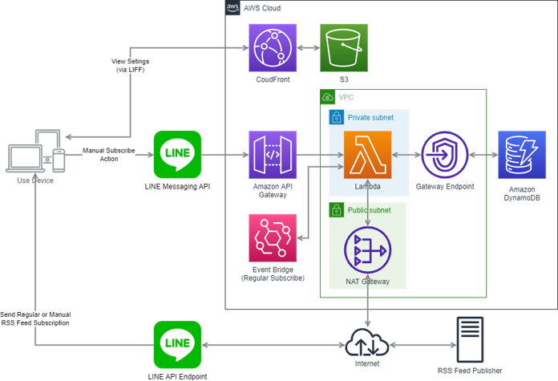

# Feed-Notifyアプリについて

## 概要

* RSSFeedで配信された記事を、LINE Messaging API経由で購読する
* 購読対象の記事は、設定用サイトで追加・削除・有効化・無効化が可能
* 定期購読のほかに、LINEでメッセージを送ることで記事を手動購読することも可能
* システム構成は以下の通り



## 環境

| 種類                 | バージョン             |
| -------------------- | ---------------------- |
| OS                   | Windows10 version 2004 |
| Node                 | 14.17.5                |
| Serverless Framework | 2.66.1                 |
| 開発環境             | VSCode & Powershell    |

## 使い方

### ⓪ LINE DEVELOPERSで、Messaging APIと、開発環境用・本番環境用それぞれのLIFFを設定

### ① 各モジュールを`npm install`でインストール

`server`ディレクトリ、`client`ディレクトリ双方で`npm install`をすればOK。

### ② `sls-settings.json`で各設定を入れる

`sls-settings.json`の内容は以下の通り。

```json
{
  "TOKEN": "XXXXXXXXXXXXXXXXXXXXXXXXXXXXXXXXXXXXXXXXXXXXXXXXXXXXXXXXXXXXXXXXXX",
  "LIFF_ID_PROD": "1234567890-aaaaaaaaa",
  "LIFF_ID_DEV": "9876543210-bbbbbbbb",
  "LAYERS_DEPLOYMENT_BUCKET": "xxxx-bucket-lambda-sls"
}
```

* `TOKEN`: LINE Messaging API経由でメッセージを送信するための認証トークン。⓪で設定した際に取得できる。
* `LIFF_ID_PROD`: 本番環境用のLIFFのID。これに紐づくURLがCloudfront-S3環境上に配備した静的サイトと連携する。⓪で設定した際に取得できる。
* `LIFF_ID_DEV`: ローカル開発環境用のLIFFのID。これに紐づくURLがローカルで開発しているサイト（https://`localhost:3001`）と連携する。⓪で設定した際に取得できる。
* `LAYERS_DEPLOYMENT_BUCKET`: Serverless Frameworkのプラグインである`Serverless-Layers`を使ってnode_modulesをLambdaのLayerに入れるために経由するS3のバケット名。あらかじめAWS上でS3バケットを作っておく。

### ③ ローカル開発環境上で動作確認する

* `server`ディレクトリ上で`serverless dynamodb install`および`serverless offline start`を実行し、サーバ側を起動させる。（`serverless-offline`および`serverless-dynamodb-local`プラグインを使用。なお、`serverless dynamodb install`は`.dynamodb`ディレクトリが作成されたら一度だけ実施すればOK）
* `client`ディレクトリ上で`.env.development.local`ファイルを作成したうえで以下のように設定を加える。その後、`npm run start`もしくは`yarn start`でクライアントサイドを起動

```env
PORT = 3001
HTTPS = "true"
REACT_APP_LIFF_ID_DEV="9876543210-bbbbbbbb"
REACT_APP_API_URL_DEV="http://localhost:3000/dev"
```

* Postman等で`http://localhost:3000/dev/webhook`にpostリクエストを飛ばしたり、クライアントサイドの画面でいろいろ動作確認を行う。postリクエストのBody例は以下。`body.events[].message.text`の内容が"?"や"設定"などの場合は設定画面、そうでない場合はRSSフィード通知をLINEに送信する。実際にLINEと連携もされるため、LINEのデスクトップアプリも入れておくとよい。

```json
{
    "destination": "xxxxxxxxxx",
    "events": [
        {
            "type": "message",
            "message": {
                "type": "text",
                "id": "xxxxxxxx",
                "text": "?"
            },
            "source": {
                "type": "user",
                "userId": "Uxxxxxxxxxxxxxxxxxxxxxxxxxxx(LINEユーザID)"
            },
            "replyToken": "xxx"
        }
    ]
}
```

### ④ トップにある`deploy.ps1`を実行する

まずはサーバー側のリソースをデプロイし、API GatewayのエンドポイントURL取得。それを環境変数に設定したうえでクライアント側のReactソースをビルドし、S3＆Cloudfront環境を構築。

### ⑤ `deploy.ps1`実行後に表示される内容をLINE Developers Consoleで設定

以下の内容が`deploy.ps1`実行後に表示されるため、`Webhook URL`をMessaging APIの`Webhook URL`に、`Endpoint URL`をLIFFの`Endpoint URL`に設定する

```powershell
*********************************
**LINE DEVELOPERS CONFIGURATION**
Endpoint URL
https://xxxxxxxxxx.execute-api.ap-northeast-1.amazonaws.com/dev/webhook
Client URL
https://xxxxxxxxxxxxxx.cloudfront.net
*********************************
```

## 技術的な仕組み

### Node.js

Version 14.17.5で構築。
Serverless Frameworkでバックエンド構築を進め、LINEとの連携はMessaging APIを使用。
設定用のWebサイトは、LIFF＋Reactで作成。画面UIについては、React-Bootstrapを利用。
AWS DynamoDBで、ユーザ情報を管理。

### Serverless Framework

Version 2.66.2で構築。
また、以下のプラグインを導入。

```shell
plugins:
  - serverless-dynamodb-local //DynamoDB接続部分の開発・テスト用
  - serverless-vpc-plugin //Lambda用のVPC作成
  - serverless-offline //ローカルでの開発・テスト
  - serverless-s3-sync //ビルドしたフロントエンドのS3アップロード
  - serverless-cloudfront-invalidate //CloudFrontのキャッシュ削除自動化
```

### LINE Messaging API

LINE上でのメッセージを受信し、適切な応答をするためにLINE Messaging APIを導入。無料枠で利用するので、月1,000件のメッセージ送信数制限には要注意・・・
応答はFlex Message（カルーセル型）もしくはテキスト形式で実施。

### LIFF

設定用のWebサイトで、LINEログインを利用しユーザID・名前・プロフィール画像を取得するために導入。

### React

設定用のWebサイトはReactベースで構築。UIはReact-Bootstrap（とFontawesome）を導入。

### DynamoDB

パーティションキーはuserId(string)。ソートキーはなし。
userIdはLINE Messaging APIにおけるuserIdに該当。
項目ごとの属性情報は下記の通り。

```json
{
 "userId": "U0000000000000000000000000000000", //ユーザID
 "lastSubscribe": "2021-11-25T01:00:19.091Z", //RSSフィードの最終配信日時
 "subscribeFeeds": [ //購読するRSSフィード情報
  {
   "feedUrl": "https://www.publickey1.jp/atom.xml",
   "addedAt": "2021-11-22T12:23:51.240Z",
   "siteUrl": "https://www.publickey1.jp/",
   "lastModifiedAt": "2021-11-21T23:23:51.240Z",
   "lastAction": "added",
   "feedId": "83004bd7-73f1-412e-aae1-0504cad9c6de",
   "title": "Publickey",
   "enabled": true
  },
  {
   "feedUrl": "https://dev.classmethod.jp/feed/",
   "addedAt": "2021-11-22T05:24:35.168Z",
   "siteUrl": "https://dev.classmethod.jp",
   "lastModifiedAt": "2021-11-21T23:24:35.168Z",
   "lastAction": "added",
   "feedId": "a1f0211d-a66f-4e54-a073-4477279a3f1c",
   "title": "DevelopersIO",
   "enabled": true
  }
 ],
 "name": "XXX" //ユーザ名
}
```

## 機能説明

イベントの一覧は以下。

* 記事の配信(subscribe)
  * 記事自動配信(subscribeFeeds, auto)
  * 記事手動配信(subscribeFeeds, manual)
* 友達の追加/解除
  * 友達の追加(follow)
  * 友達の解除(unfollow)
* 記事取得先の制御(feedUrls)
  * 記事取得先の追加(addFeedUrl)
  * 記事取得先の一覧取得(getAllFeedUrl)
  * 記事取得先無効化(disableFeedUrl)
  * 記事取得先有効化(enableFeedUrl)
  * 記事取得先の削除(deleteFeedUrl)

### 記事の配信

* エンドポイント制御ファイル → `/webhook.js`  
* DynamoDB制御ファイル → `/io/subscribe.js`
* 自動配信定義 → Event Bridge (日本時間で6:00, 10:00, 14:00, 18:00, 22:00)

| イベント     | エンドポイント | イベントタイプ   | db io          |
| ------------ | -------------- | ---------------- | -------------- |
| 記事自動配信 | /webhook       | - (Event Bridge) | subscribeFeeds |
| 記事手動配信 | /webhook       | message          | subscribeFeeds |

### 友達の追加/解除

* エンドポイント制御ファイル → `/webhook.js`  
* DynamoDB制御ファイル → `/io/follow.js`

| イベント   | エンドポイント | イベントタイプ | db io    | DynamoDB    |
| ---------- | -------------- | -------------- | -------- | ----------- |
| 友達の追加 | /webhook       | follow         | follow   | add new key |
| 友達の解除 | /webhook       | unfollow       | unfollow | delete key  |

### 記事取得先の制御

* エンドポイント制御ファイル → `/feed.js`  
* DynamoDB制御ファイル → `/io/feedList.js`

| イベント             | エンドポイント | メソッド | db io           | DynamoDB                       |
| -------------------- | -------------- | -------- | --------------- | ------------------------------ |
| 記事取得先の追加     | /feed          | POST     | addFeedList     | get current list & push update |
| 記事取得先の一覧取得 | /feed          | GET      | getAllFeedList  | get current list               |
| 記事取得先無効化     | /feed          | PUT      | disableFeedList | get current list & push update |
| 記事取得先有効化     | /feed          | PUT      | enableFeedList  | get current list & push update |
| 記事取得先の削除     | /feed          | DELETE   | deleteFeedList  | get current list & push update |

## ソース概要

### /server

#### /functions

#### /io

#### /lib

`/lib`配下のモジュールは下記の通り。

```shell
/lib
 logger.js //アクセスログをコンソールに出力
 dateUtil.js //日時のフォーマット、並べ替えを実施
 getFeedContents.js //URLと最終取得日付を引数に、記事情報を取得（カルーセルに入るよう、文字数も丸める）
 createMessages.js //イベントタイプがmessageだった場合のLineにプッシュするメッセージを作成
```

### /client

#### /src

#### /src/components

## ハマったところ

### Missing Authentication Tokenエラー

### https化

### outbound80の手動穴あけ

### TypeError: Cannot read property 'pipesCount' of undefined

### yarn build時の環境変数読み込み
